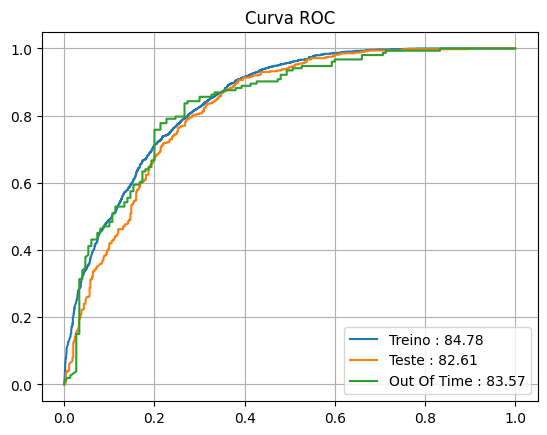

# 📉 Churn Prediction com Metodologia SEMMA

Projeto de Data Science aplicando a metodologia **SEMMA** para prever churn (evasão de usuários) em uma plataforma de streaming.

O objetivo foi identificar quais usuários são mais propensos a deixar de acompanhar um determinado canal, consolidando conceitos de pré-processamento, modelagem e validação.

---

## 🎯 Objetivo do Projeto

Construir um modelo preditivo capaz de:

- Identificar usuários com maior probabilidade de churn  
- Avaliar estabilidade temporal do modelo  
- Aplicar boas práticas de validação  
- Versionar experimentos de forma estruturada  

---

## 🧠 Metodologia Utilizada — SEMMA

A metodologia SEMMA, criada pelo SAS Institute, é focada principalmente nas etapas técnicas da modelagem, como preparação dos dados, engenharia de atributos, construção e avaliação do modelo. Embora seja semelhante ao CRISP-DM, ela possui menor ênfase no entendimento do contexto de negócio, concentrando-se mais no processo analítico e estatístico.

---

## 🔄 Etapas do Projeto

### 🔹 1. Sample (Amostragem)

- Divisão do conjunto de dados em:
  - Treino
  - Teste
  - Out of Time (OOT)

A divisão OOT foi utilizada para avaliar a estabilidade temporal do modelo.

---

### 🔹 2. Explore (Exploração)

- Análise exploratória dos dados
- Utilização de árvores de decisão para identificar variáveis mais relevantes

---

### 🔹 3. Modify (Preparação)

- Seleção das melhores features
- Discretização com árvores de decisão
- Aplicação de One-Hot Encoding para variáveis categóricas

---

### 🔹 4. Model (Modelagem)

- Implementação de um modelo Random Forest
- Uso de Pipeline do Scikit-learn
- Otimização de hiperparâmetros com GridSearch

---

### 🔹 5. Assess (Avaliação)

- Métricas utilizadas:
  - AUC (principal)
  - Acurácia

- Versionamento de experimentos com MLflow

---

## 🛠 Tecnologias Utilizadas

- Python  
- Pandas  
- Scikit-learn  
- MLflow  
- Matplotlib / Seaborn  
- Kaggle Dataset  

## 📊 Resultados

### AUC

- 🔹 Treino: **84.78%**
- 🔹 Teste: **82.61%**
- 🔹 Out of Time: **83.57%**

